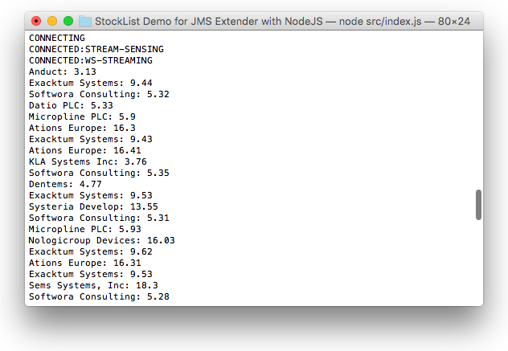

# Lightstreamer JMS Extender - Basic Stock-List Demo - Node.js Client

<!-- START DESCRIPTION lightstreamer-jms-example-stocklist-client-node -->

This project contains a sample Node.js concole application that shows how the [Lightstreamer JMS Extender JavaScript Client Library](https://www.npmjs.com/package/lightstreamer-jms-node-client) can be used to connect to Lightstreamer JMS Extender.



## Details

This demo displays real-time market data for 20 stocks, generated by the feed simulator included in the [Stock-List Demo Java Service](https://github.com/Lightstreamer/Lightstreamer-JMS-example-StockList-service-java). For simplicity, only the "stock_name" and "last_price" fields of updated items are displayed, and they are just logged to the console. Moreover, a single JMS topic is used for all stocks, while in a real scenario you would probably use a different JMS topic for each stock.

Check out the sources for further explanations.

## Install

If you want to install a version of this demo pointing to your local Lightstreamer JMS Extender, follow these steps.
In particular, this readme file details the steps required to execute the demo calling the node executable from the command line.

* Note that, as prerequisite, the [Lightstreamer JMS Extender - Stock-List Demo - Java (JMS) Service](https://github.com/Lightstreamer/Lightstreamer-JMS-example-StockList-service-java) has to be deployed on your local Lightstreamer JMS Extender instance. Please check out that project and follow the installation instructions provided with it.

* Launch Lightstreamer JMS Extender.

* If required, install Node.js

* From the `src` folder, locally install the client application by using `npm`:

  ```sh
  $ npm install
  ```


<!-- END DESCRIPTION lightstreamer-jms-example-stocklist-client-node -->

## Configure

Now, you need to configure `src/client.js` of this example by specifying the name of the JMS connector you are going to use. By default, the demo will look for the **ActiveMQ** JMS connector, please refer to the related [Service project](https://github.com/Lightstreamer/Lightstreamer-JMS-example-StockList-service-java) for more details on the choice of a JMS broker to be used.
To set the JMS connector name, look where the connection is created:

```js
  jms.TopicConnectionFactory.createTopicConnection("http://localhost:8080/", "ActiveMQ", null, null, {
```

## Launch
From the `src` folder, run:

```sh
$ node client.js
```

## See Also

### Lightstreamer Service Needed by This Demo Client

<!-- START RELATED_ENTRIES -->
* [Lightstreamer JMS Extender - Stock-List Demo - Java (JMS) Service](https://github.com/Lightstreamer/Lightstreamer-JMS-example-StockList-service-java)

<!-- END RELATED_ENTRIES -->
### Related Projects

* [Lightstreamer JMS Extender - Basic Stock-List Demo - HTML Client](https://github.com/Lightstreamer/Lightstreamer-JMS-example-StockList-client-javascript)
* [Lightstreamer JMS Extender - Basic Chat Demo - HTML Client](https://github.com/Lightstreamer/Lightstreamer-JMS-example-Chat-client-javascript)
* [Lightstreamer JMS Extender - Basic Portfolio Demo - HTML Client](https://github.com/Lightstreamer/Lightstreamer-JMS-example-Portfolio-client-javascript)
* [Lightstreamer - Stock-List Demos - HTML Clients](https://github.com/Lightstreamer/Lightstreamer-example-StockList-client-javascript)

## Lightstreamer Compatibility Notes

* Compatible with Lightstreamer JMS Extender SDK for Node.js Clients since version 2.0.0 or newer.
* Compatible with Lightstreamer JMS Extender since version 2.0.0 or newer.
